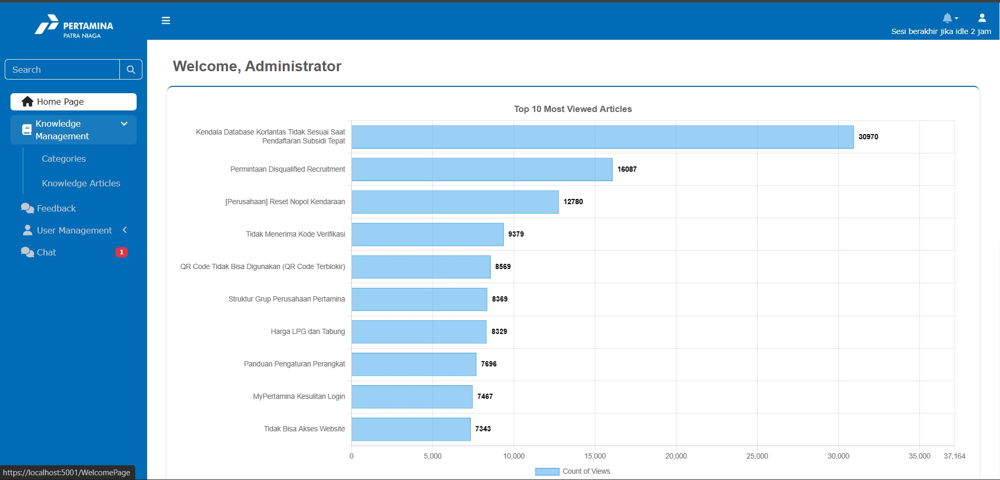
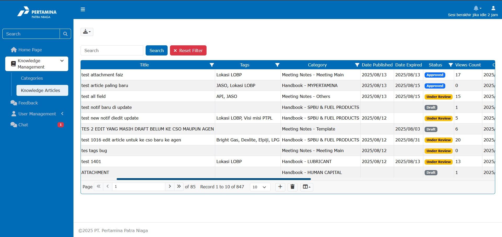
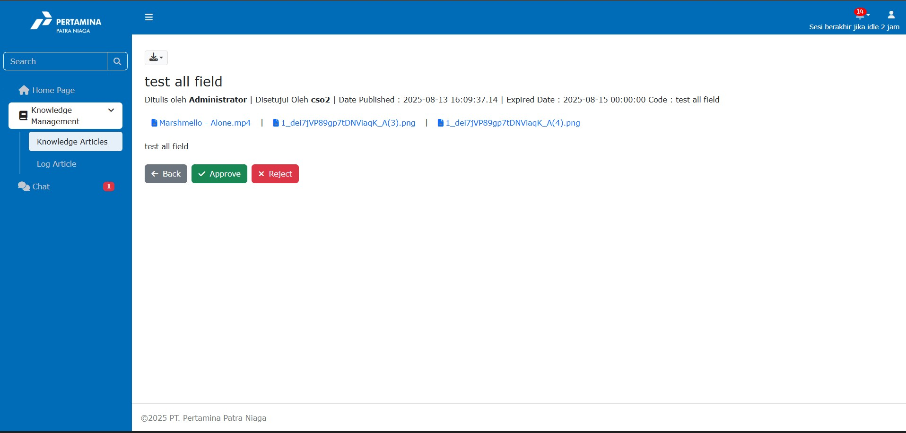
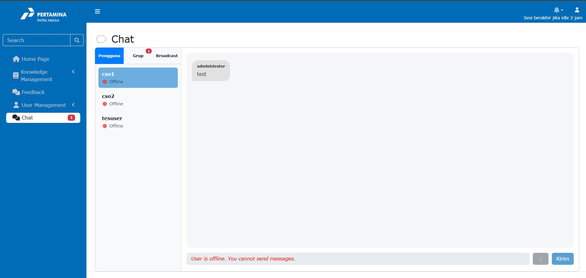
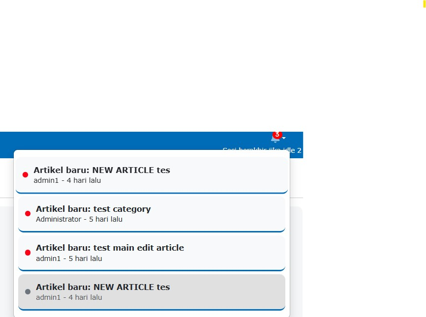
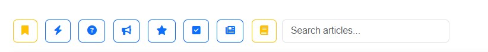
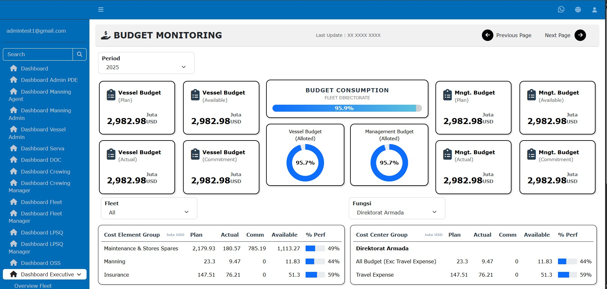
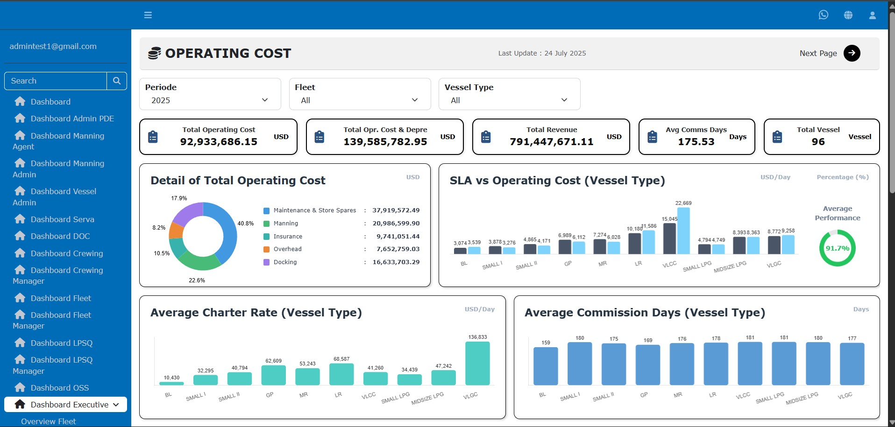
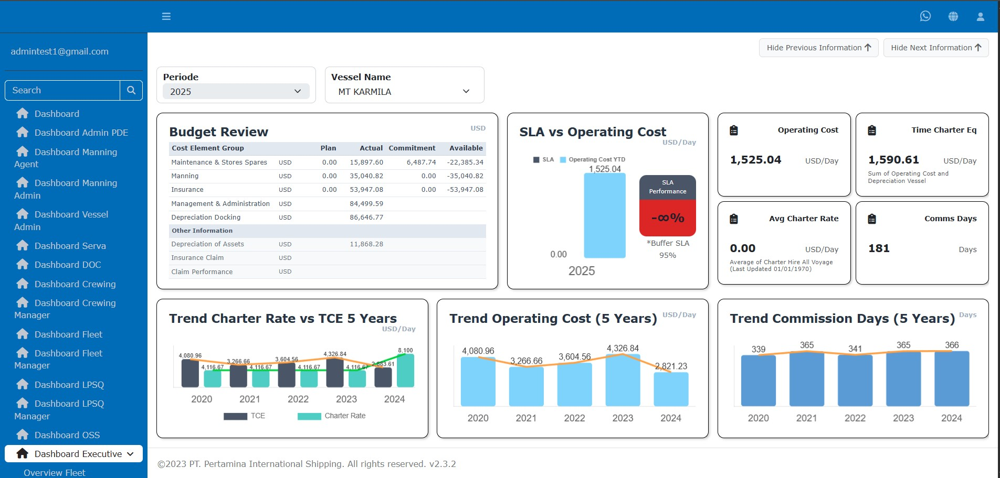

# 🚀 CIP Tools Enhancement

CIP Tools Enhancement adalah aplikasi internal PT Trakindo Utama untuk mempermudah monitoring, pengolahan, dan pelaporan data Customer Interaction Program (CIP).  
Sistem ini dirancang untuk mengotomatisasi proses yang sebelumnya manual (banyak menggunakan Excel), sehingga lebih cepat, akurat, dan terintegrasi.

---

## 📌 Latar Belakang
Sebelum adanya CIP Tools Enhancement, proses monitoring survey masih menghadapi tantangan:
- **Banyak pekerjaan manual** (dominasi Excel).
- **Waktu pemrosesan lama** untuk menyiapkan data siap survei.
- **Kompleksitas tinggi** dalam validasi dan pelaporan data.
  
Hal ini menimbulkan kebutuhan akan sistem terintegrasi yang mampu menangani alur survei **end-to-end**: dari persiapan *customer list*, monitoring survei, hingga laporan penyelesaian:contentReference[oaicite:0]{index=0}.

---

## 🎯 Tujuan Proyek
- Menyediakan **end-to-end workflow CIP survey** yang cepat dan akurat.  
- Mengurangi pekerjaan manual melalui **otomatisasi input, monitoring, dan pelaporan**.  
- Memberikan **dashboard interaktif** untuk memantau status survei, SLA tiket, dan alert.  

---

## ✨ Fitur Utama

### 1. Dashboard Monitoring
- Menampilkan status tiket terbuka/tertutup.
- SLA monitoring (*Tickets Open >24 hours, Average Resolution Time*).
- Visualisasi status dalam bentuk card interaktif.  

---

### 2. Survey Monitoring
- Validasi customer list (cleansing, exclusion, temporary hold).  
- Monitoring status survei: *Complete* vs *Not Complete*.  
- Breakdown data per **area, region, cabang**.  

---

### 3. Alert Management
- **CIP Admin** → assign alert ke **PIC Area**.  
- **PIC Area** → menginput hasil resolusi.  
- Tracking status alert: *Open → Assigned → Resolved → Closed*.  
- **Email notifikasi otomatis** setelah status berubah.  

---

### 4. Data Upload & Integrasi
- Upload **Complete Survey**, **BIC**, **Disposition Call**.  
- Mendukung file Excel dengan struktur tabel database.  
- Terintegrasi dengan **Power BI** untuk analisis lanjutan.  

---

### 5. Reporting & Download
- Export data ke Excel (summary maupun detail).  
- Laporan alert resolution & survey monitoring bisa diunduh per periode.  

---

## 🛠️ Teknologi yang Digunakan
- **Backend:** ASP.NET Core  
- **Frontend:** Bootstrap, jQuery, Chart.js  
- **Database:** Microsoft SQL Server  
- **Integrasi:** Power BI untuk analitik lanjutan  
- **Hosting:** Internal Dev Server (Trakindo)  

---

## 📊 Hasil & Dampak
- Proses data survey menjadi **otomatis & efisien**.  
- Waktu pemrosesan turun drastis dibanding metode manual.  
- Monitoring SLA & kepuasan pelanggan lebih **transparan & real-time**.  
- Mempermudah manajemen mengambil keputusan berbasis data.  

---

## 👩‍💻 Peran & Kontribusi

- Mendesain **flow proses & arsitektur sistem**.  
- Mengembangkan modul **Dashboard Monitoring** & **Alert Resolution**.  
- Menyusun query SQL untuk laporan survei & alert.  
- Membuat dokumentasi & panduan penggunaan sistem.  

---

## 📷 Dokumentasi Screenshots
Beberapa tampilan aplikasi:

- Dashboard Monitoring  
  

- Not Yet Complete Survey  
  

- Complete Survey Detail  
  

- Alert Resolution Form  
  

---

## 📌 Catatan
Proyek ini merupakan aplikasi internal **PT Trakindo Utama**.  
Hak cipta © 2024 PT Trakindo Utama. All rights reserved.

# 📂 Document Management System – PT Patra Niaga

Sistem ini dikembangkan untuk **mengelola artikel dan dokumen internal** yang dapat diakses oleh agen-agen PT Patra Niaga.  
Tujuannya adalah agar distribusi informasi, pengetahuan, dan komunikasi antar agen dapat dilakukan secara lebih **terstruktur, cepat, dan efisien**.

---

## 🎯 Tujuan
- Menyediakan wadah terpusat untuk artikel dan dokumen penting.  
- Mempermudah agen mengakses, mencari, dan memanfaatkan pengetahuan.  
- Menyediakan sistem komunikasi internal antar agen.  
- Mendukung persetujuan (*approval*) dokumen secara digital.  

---

## ✨ Fitur Utama

### 1. Dashboard
- Tampilan utama yang menyajikan ringkasan aktivitas sistem.  
- Grafik/statistik penggunaan dokumen dan artikel.  

---

### 2. Knowledge Management
- Penyimpanan & pengelolaan artikel/dokumen.  
- Artikel dikelompokkan berdasarkan **kategori utama (main_category)**.  
- Mempermudah agen menemukan pengetahuan sesuai bidang.  

---

### 3. Approval (CSO Approval)
- Proses **approve dokumen** secara digital sebelum dipublikasikan.  
- Meningkatkan akurasi & validitas artikel yang disebarkan ke agen.  

---

### 4. Chat / Komunikasi Internal
- Fitur **chat antar agen** untuk diskusi langsung terkait dokumen/artikel.
- Fitur Broadcast mempercepat informasi penting dan urgent
- Mendukung kolaborasi cepat.  

---

### 5. My Note
- Agen bisa membuat catatan pribadi terkait dokumen/artikel.  
- Menjadi *knowledge base* personal untuk masing-masing user.  

---

### 6. Notification
- Sistem notifikasi untuk mengingatkan update dokumen/artikel.  
- Termasuk notifikasi approval, artikel baru, maupun komentar baru.  

---

### 7. Quick Filter
- Pencarian artikel/dokumen lebih cepat dengan **filter kategori & metadata**.  
- Mempercepat navigasi dalam jumlah dokumen yang besar.  

---

## 🛠️ Teknologi yang Digunakan
- **Frontend:** (contoh: React.js / Bootstrap)  
- **Backend:** (contoh: ASP.NET Core / Laravel / Node.js)  
- **Database:** MySQL / SQL Server  
- **Authentication:** Role-based Access Control (Admin, CSO, Agen)  

*(silakan sesuaikan dengan stack yang sebenarnya dipakai)*

---

## 📊 Dampak Sistem
- Distribusi pengetahuan antar agen lebih cepat & terkontrol.  
- Proses approval dokumen lebih transparan.  
- Komunikasi internal agen meningkat melalui chat & notifikasi.  
- Agen lebih mudah menemukan informasi dengan kategori & quick filter.  

---

## 👩‍💻 Peran & Kontribusi

- Mendesain arsitektur sistem & alur approval dokumen.  
- Mengembangkan modul **Knowledge Management & Approval**.  
- Membuat fitur **Chat, Notification, MyNote, Quick Filter**.  
- Menyusun dokumentasi sistem & panduan user.  

---

## 📌 Catatan
Sistem ini merupakan aplikasi internal **PT Patra Niaga** untuk mendukung operasional agen.  
Hak cipta © PT Patra Niaga. All rights reserved.

# 💹 Venus Finance – PT Pertamina Shipping

**Venus Finance** adalah aplikasi dashboard keuangan yang dikembangkan untuk **PT Pertamina Internasional Shipping**.  
Sistem ini mendukung monitoring keuangan secara **real-time** mencakup anggaran, biaya docking, investasi, hingga biaya operasional, sehingga mempermudah manajemen dalam pengambilan keputusan.

---

## 🎯 Tujuan
- Menyediakan **dashboard keuangan terintegrasi** bagi manajemen.  
- Mempermudah analisis budget, OPEX, dan investasi.  
- Mengurangi pekerjaan manual dalam laporan keuangan.  
- Memberikan **visualisasi data** yang lebih mudah dipahami.  

---

## ✨ Fitur Utama

### 📊 Budget Monitoring
- Monitoring realisasi anggaran terhadap budget.  
- Identifikasi potensi *over budget*.  
- Visualisasi progress pemakaian anggaran.  

---

### ⚓ Docking Monitoring
- Pemantauan biaya docking kapal.  
- Perbandingan biaya aktual vs estimasi.  
- Tren biaya docking per periode.  
  

---

### 💰 Investment Monitoring
- Analisis kinerja investasi.  
- Menampilkan ROI, IRR, dan nilai proyek.  
- Grafik & pie chart untuk memudahkan pemahaman.  

---

### 🔧 Operating Cost Monitoring
- Monitoring biaya operasional (OPEX).  
- Breakdown biaya berdasarkan kategori (SDM, perawatan, bahan bakar, dll).  
- Kontrol efisiensi biaya operasional perusahaan.  
  

---

## 🛠️ Teknologi yang Digunakan
- **Frontend:** Dashboard berbasis Bootstrap / Power BI / Chart.js (disesuaikan)  
- **Backend:** ASP.NET Core / Node.js (disesuaikan)  
- **Database:** SQL Server / Oracle  
- **Integrasi:** API keuangan internal PT Pertamina Shipping  

---

## 📊 Dampak Sistem
- Memberikan **transparansi** keuangan perusahaan.  
- Mempercepat analisis laporan bulanan & tahunan.  
- Mengurangi risiko kesalahan input manual.  
- Mendukung pengambilan keputusan strategis berbasis data.  

---

## 👩‍💻 Peran & Kontribusi
- Mendesain arsitektur dashboard dan integrasi data keuangan.  
- Mengembangkan modul **Budget Monitoring & Docking Monitoring**.  
- Membuat query & pipeline data untuk analisis investasi dan OPEX.  
- Menyusun dokumentasi & user guide untuk pengguna internal.  

---

## 📌 Catatan
Proyek ini merupakan aplikasi internal **PT Pertamina Internasional Shipping**.  
Hak cipta © PT Pertamina Shipping. All rights reserved.

